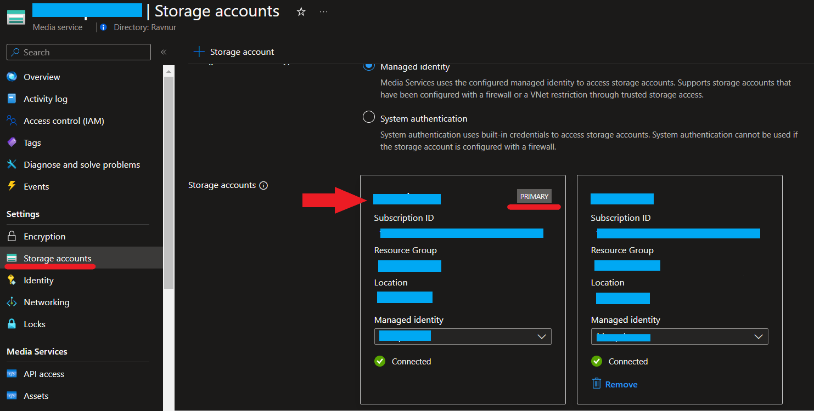

# Application migration to RMS

## Pre-requisits

✅ You have an RMS instance deployed using Azure Marketplace

✅ You have a Microsoft account which has access to an Azure Tenant where RMS instance is deployed

## Get RMS connection credentials

* On Azure Portal go to RMS Managed Application resource: Managed Applications center -> Marketplace Applications -> Find RMS Application and open it
* Then click on "Parameters and Outputs" 
* In the list of outputs copy "consoleURL" and open it in browser 
* On the Console page copy all neccessry RMS connection and save them to be later specified in your app configuration


## Register your AMS storage(s) in RMS

* In RMS Console page press "Manage" button for your RMS account 
* Go to your AMS storages list. You need to register all of them but start with primary one

* Set name, key 1 and key 2
  
  
* Make it primary
  
* Remove existing default storage (optional)

* Add all secondary storages if any

> [!NOTE] **Storage account keys rotation**. If you are going to rotate your storage keys don't forget to update them in RMS Console ("Save" button).

## Migrate you application

RMS API mirrors AMS API that's why there is no dramatic code changes required. You can keep using your SDK and logic without changes. However RMS has different authentication scheme that's why you need to update your code to use new type of credentials.
You can just copy them from here:

* For **Azure.ResourceManager.Media SDK** use [this implementation](../sdk-azure-resource-manager-demo/RmsApiKeyCredentials.cs)
* For **Microsoft.Azure.Management.Media SDK** use [this implementation](../sdk-ms-azure-management-demo/RmsApiKeyCredentials.cs)

Then your media service client initialization code will look like this:

```CSharp
// For Microsoft.Azure.Management.Media SDK
var credentials = new RmsApiKeyCredentials(
    new Uri("<RMS API endpoint>"),
    "<RMS Subscription ID>",
    "<RMS API Key>");

var mediaServicesClient = new AzureMediaServicesClient(credentials, new HttpClient(), true)
{
    SubscriptionId = "<RMS Subscription ID>"
};
// All mediaServicesClient method calls then use RMS Resource Group and Account Name
```

or

```CSharp
// For Azure.ResourceManager.Media SDK
var credentials = new RmsApiKeyCredentials(
    new Uri("<RMS API endpoint>"),
    "<RMS Subscription ID>",
    "<RMS API Key>");

ArmClient armClient = new ArmClient(
        credentials,
        "<RMS Subscription ID>",
        new ArmClientOptions
        {
            Environment = new ArmEnvironment(new Uri("<RMS API endpoint>"), "test"),
        });

var mediaServicesAccountIdentifier = MediaServicesAccountResource.CreateResourceIdentifier(
    "<RMS Subscription ID>",
    "<RMS Resource Group Name>",
    "<RMS Account Name>");

var mediaServiceClient = armClient.GetMediaServicesAccountResource(mediaServicesAccountIdentifier)
```

You can see in details how it is done for demo application, which can switch between AMS and RMS:

* For **Azure.ResourceManager.Media SDK** [sdk-azure-resource-manager-demo](sdk-azure-resource-manager-demo)
* For **Microsoft.Azure.Management.Media SDK**, please use this application: [sdk-ms-azure-management-demo](sdk-ms-azure-management-demo).

## Replace Azure Media Player with another player

Azure Media Player was developed specifically for AMS streams and do not work with any streaming link you provide it with. RMS is not exception: AMP does not work with RMS streams. You need to use a different player. At the moment the following players are consistent with RMS:

* [Ravnur Media Player](https://strmsdemo.z13.web.core.windows.net/)
* hls.js
* dash.js

## Change Event Grid subscriptions

RMS produces same Event Grid events schema as AMS. Use [these instructions](monitoring.md) to change your current Event Grid subscriptons to listen RMS events instead.

> [!NOTE] In this case your RMS instance should be deployed to the same subscription as your current AMS account.

## Repoint your CDN to RMS original

* Go to your CDN profile:
  * In azure portal go to your AMS account → Endpoints
  * Select endpoint you use for streaming
  * Navigate to its CDN profile
* Select endpoint routed to your AMS endpoint 
* Change origin to your RMS streaming domain (it matches with RMS API endpoint domain) 
* Wait for origin change to be propagated in CDN. It can take a while. To ensure that new origin is available you can check URL in browser "https://{AMS streamin endpoint domain}/console"
* Change RMS streaming endpoint hostName
  * Go to RMS Console -> Manage -> Streaming Endpoints
  
  * In Host Name text box specify host name of your current AMS account streaming endpoint and press "Save"
  

> [!NOTE] At this point your existing VOD URLs will not work. To fix that AMS data migration is required. It comes soon.
