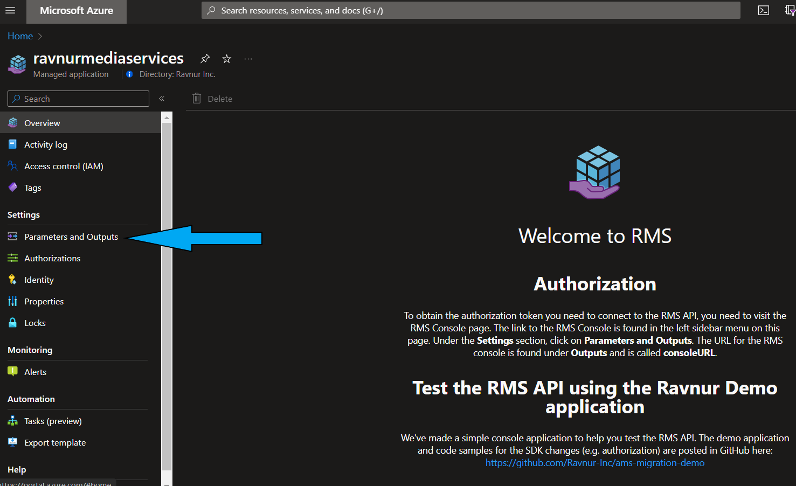
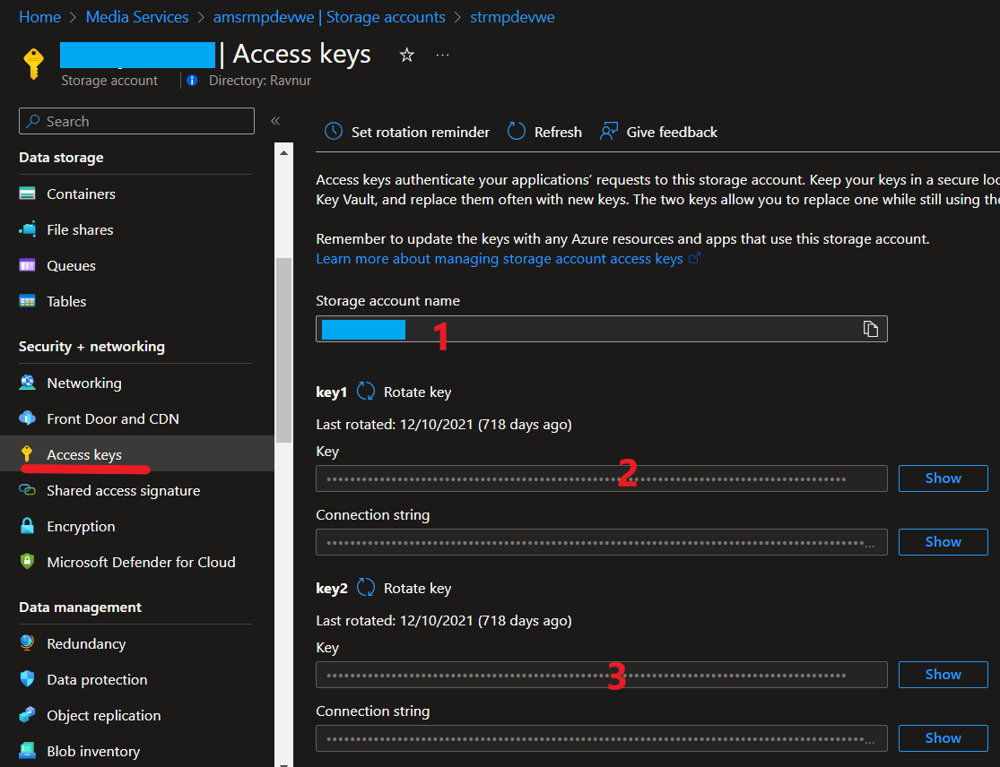

# Application Migration to RMS

## Prerequisites

✅ You have an RMS instance deployed using Azure Marketplace.

✅ You have a Microsoft account with access to an Azure Tenant where the RMS instance is deployed.

## Get RMS Connection Credentials

1. On the Azure Portal, go to RMS Managed Application resource: Managed Applications center -> Marketplace Applications -> Find RMS Application and open it.
2. Then click on "Parameters and Outputs". 
3. In the list of outputs, copy "consoleURL" and open it in a browser. 
4. On the Console page, copy all necessary RMS connection credentials and save them to be later specified in your app configuration.
   
   * 1 - RMS Subscription ID;
   * 2 - RMS Resource Group Name;
   * 3 - RMS Account Name;
   * 4 - RMS API Key
   * 5 - RMS API Endpoint (`https://rms.{unique-string}.ravnur.net`).

## Register Your AMS Storage(s) in RMS

1. In the RMS Console page, press the "Manage" button for your RMS account. 
2. Go to your AMS account storage list. You need to register all of them but start with the primary one.
   
3. Set the name, key 1, and key 2.
   
   
4. Make it primary.
   
5. Remove the existing default storage (optional).
   
6. Add all secondary storages, if any.

> [!NOTE] **Storage Account Keys Rotation**: If you plan to rotate your storage keys, don't forget to update them in the RMS Console using the "Save" button.

## Migrate Your Application

The RMS API mirrors the AMS API, meaning no significant code changes are required. You can continue using your existing SDK and logic without modifications. However, RMS uses a different authentication scheme, so you will need to update your code to use the new credentials. You can copy them from the following sources:

* For **Azure.ResourceManager.Media SDK**, use [this implementation](../sdk-azure-resource-manager-demo/RmsApiKeyCredentials.cs).
* For **Microsoft.Azure.Management.Media SDK**, use [this implementation](../sdk-ms-azure-management-demo/RmsApiKeyCredentials.cs).

Then your media service client initialization code will look like this:

```CSharp
// For Microsoft.Azure.Management.Media SDK
var credentials = new RmsApiKeyCredentials(
    new Uri("<RMS API endpoint>"),
    "<RMS Subscription ID>",
    "<RMS API Key>");

var mediaServicesClient = new AzureMediaServicesClient(credentials, new HttpClient(), true)
{
    SubscriptionId = "<RMS Subscription ID>"
};
// All mediaServicesClient method calls then use RMS Resource Group and Account Name
```

or

```CSharp
// For Azure.ResourceManager.Media SDK
var credentials = new RmsApiKeyCredentials(
    new Uri("<RMS API endpoint>"),
    "<RMS Subscription ID>",
    "<RMS API Key>");

ArmClient armClient = new ArmClient(
        credentials,
        "<RMS Subscription ID>",
        new ArmClientOptions
        {
            Environment = new ArmEnvironment(new Uri("<RMS API endpoint>"), "test"),
        });

var mediaServicesAccountIdentifier = MediaServicesAccountResource.CreateResourceIdentifier(
    "<RMS Subscription ID>",
    "<RMS Resource Group Name>",
    "<RMS Account Name>");

var mediaServiceClient = armClient.GetMediaServicesAccountResource(mediaServicesAccountIdentifier)
```

After applying these updates, your media service client initialization will be adapted for RMS.

You can see detailed implementations for a demo application that can switch between AMS and RMS:

* For **Azure.ResourceManager.Media SDK**, see [sdk-azure-resource-manager-demo](../sdk-azure-resource-manager-demo).
* For **Microsoft.Azure.Management.Media SDK**, see [sdk-ms-azure-management-demo](../sdk-ms-azure-management-demo).

## Replace Azure Media Player with Another Player

Azure Media Player was developed specifically for AMS streams and does not work with other streaming links, including those from RMS. You need to use a different player. Currently, the following players are compatible with RMS:

* [Ravnur Media Player](https://strmsdemo.z13.web.core.windows.net/)
* hls.js
* dash.js

You can find developer guide how to setup Ravnur Media Player [here](ravnur-player-instructions.md).

## Change Event Grid Subscriptions

RMS produces the same Event Grid events schema as AMS. Use [these instructions](monitoring.md) to change your current Event Grid subscriptions to listen to RMS events instead.

> [!NOTE] For this, your RMS instance should be deployed in the same subscription as your current AMS account.

## Repoint Your CDN to RMS Original

1. Go to your CDN profile:
   * In the Azure portal, go to your AMS account → Endpoints.
   * Select the endpoint you use for streaming.
   * Navigate to its CDN profile.
2. Select the endpoint routed to your AMS endpoint. 
3. Change the origin to your RMS streaming domain (it matches the RMS API endpoint domain). 
4. Wait for the origin change to propagate in the CDN. This can take a while. To ensure that the new origin is available, you can check the URL in a browser: "https://{AMS streaming endpoint domain}/console".
5. Change the RMS streaming endpoint hostname:
   * Go to RMS Console -> Manage -> Streaming Endpoints.
     
   * In the Host Name text box, specify the hostname of your current AMS account streaming endpoint and press "Save".
     

> [!NOTE] At this point, your existing VOD URLs will not work. To fix this, AMS data migration is required, which will be addressed soon
