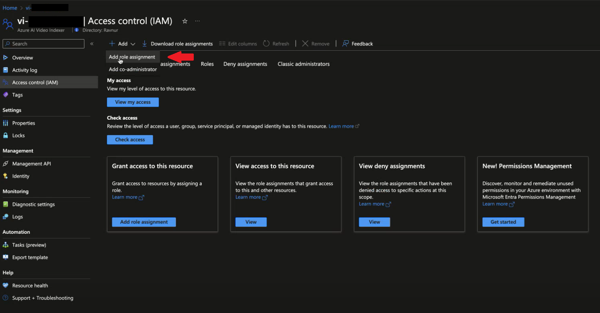
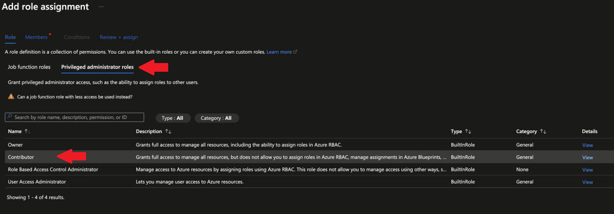
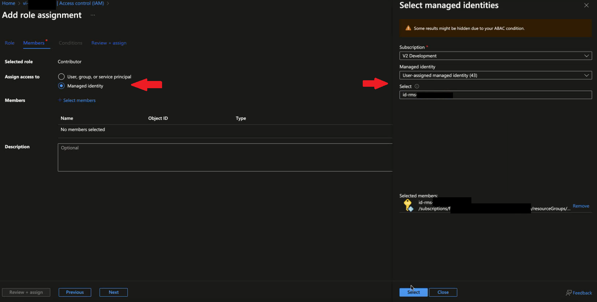
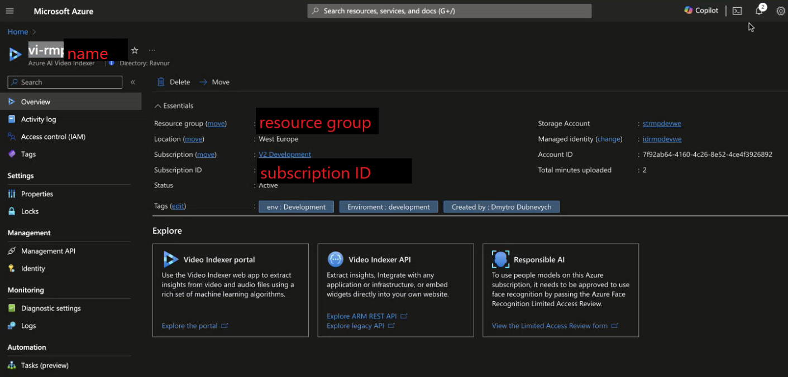

# CC generation using Video Indexer in RMS (beta)

Generate subtitles from the audio record of your videos now with the "Video indexer" service available. It can be configured in the RMS Console with the help of this guide.

> [!NOTE]
> Currently this functionality is in beta version. If you face any issue with it. Do not hesitate to contact us.

## Prerequisites

✅  Create a video indexer account (azure)

> [!NOTE]
> Placing Video Indexer account in the RMS Managed Resource group leads to access issues. Video Indexer account, Video Indexer storage and the Managed Identity it employs for authorization should be located outside the RMS Managed Resource group.

## Grant RMS managed identity the Video Indexer "Contributor" role

1. Go to the managed resource group and locate the “Managed Identity” section with the Managed Identity name. Copy it for later.
    > [!NOTE]
    > The format will always have a pattern of id-rms-{unique-suffix}

2. Select your Azure AI Video Indexer

3. Navigate to "Access Control (IAM)"

4. Press the "Add">"Add role assignment"
    

5. Switch the tab to "Privileged administrator roles" and press the "Contributor" role
    

6. Press the "Managed identity" and "Select members"

7. In the new window, set the Managed identity as "User-assigned managed identity" and set the Select field to be your Managed Identity from step 1).

    

8. Finally, press "Select", change the tab to "Review+assign" and press the button "Review+assign" in the left corner.

As a result, this Managed Identity has access to the Video Indexer.

## Register Video Indexer in RMS

1. Use the Azure Portal credentials to set up the Video Indexer.

   * Account name.

   * Resource group

   * Subscription ID

    

2. Open the RMS Console and click the “Manage” button.

3. Enter the credentials and press the "Add" button in the RMS Console.

This is it. Now you can run jobs for AudioAnalyzer preset.
