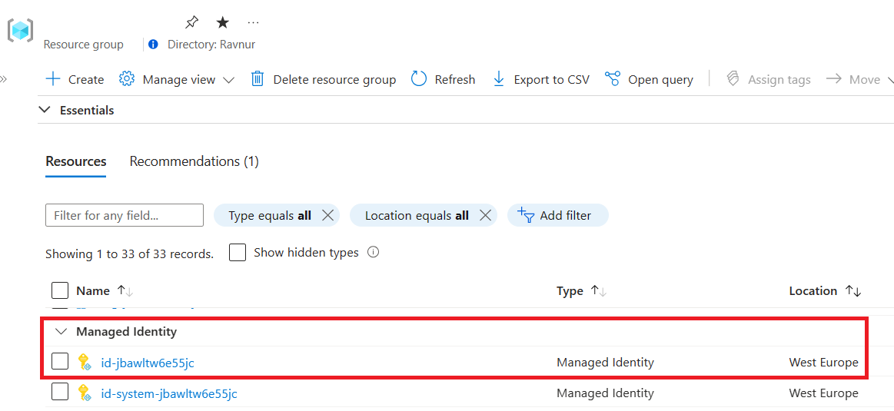
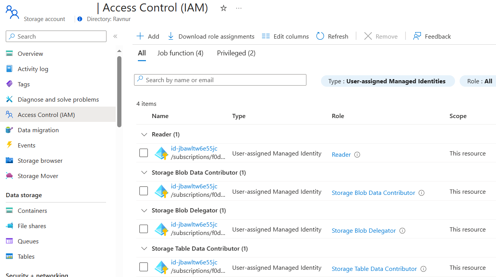

## Ravnur Media Services custom storage account support

Ravnur Media Services provides the feature of connecting a custom storage account as a media content storage. You will need to setup user-assigned managed identity access to your storage account to enable passwordless connection between RMS and your storage account.

The following sections provides step-by-step guide on how to connect custom storage to Ravnur Media Services

### Locate the User-Assigned Managed Identity

1. Go the resource group created as part of the Ravnur Media Services deployment
2. Under the list of resources, go to the “Managed Identity” section

> The name of the Managed wll be unique for your specific deployment, however, it always follows a pattern "id-\<unique-suffix\>"

### Grant storage permissions to the Managed Identity

1. Go the storage account you want to connect with Ravnur Media Services
2. Navigate to Access Control (IAM) section
3. Assing following roles to the Managed Identity from Ravnur Media Services resource group:
- Reader
- Storage Blob Data Contributor
- Storage Blob Delegator
- Storage Table Data Contributor

### Add storage configuration to the Ravnur Media Services

1. Navigate to the Ravnur Media Services management console

> The url to access RMS management console will be unique for your specific deployment, however, it always follows a pattern "https://rms.\<unique-suffix\>.ravnur.net/console"

2. Click "Manage" button for the corresponding account

3. Add new storage account record

- The "Name" field should contain name of the storage account you connecting
- The "Managed Identity" field should contain client ID of the Managed Identity from Ravnur Media Services resource group

4. Set new storage account as default

> It may take up to 10 minutes to propagate change of the default storage account throughout the system

