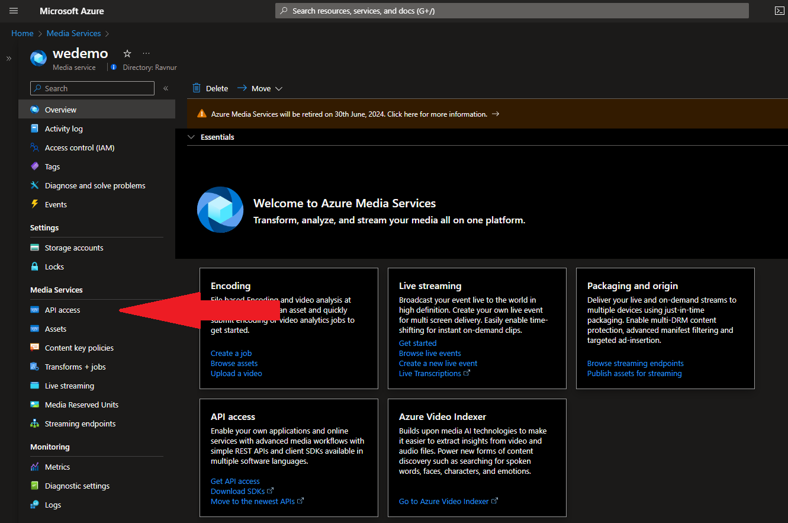

# Application Migration to RMS

To make all of yours media stored in AMS account playable in RMS you need to run migration procedure. It will extract all required resources from AMS account and save them in RMS database.

List of entities that will be migrated:
- Transforms
- Content Key Policies
- Streaming Policies
- Assets
- Streaming Locators

## Get AMS credentials
1. On the Azure Portal, go to RMS Managed Application resource: Managed Applications center -> Marketplace Applications -> Find RMS Application and open it.

2. Go to API Access.
      

3. Scroll down to "Connect to Media Services API" section and select JSON view.
      

4. To get AZURE_CLIENT_ID and AZURE_CLIENT_SECRET values use this instruction: [https://learn.microsoft.com/en-us/azure/databricks/dev-tools/service-prin-aad-token](https://learn.microsoft.com/en-us/azure/databricks/dev-tools/service-prin-aad-token#--provision-a-service-principal-in-azure-portal). Please set Token expiration not less than a 1 week because migration process can take days depending on count of your media. Alsom make sure that your AMS account has Microsoft Entra Id (AAD) application assigned with role "Contributor".
      
   
## Start Migration

1. Go to RMS Console and press the "Data migration" button for your RMS account.
      
You will se the form where you should enter AMS Api Access JSON credentials in JSON format and comma separated list of emails for notifications about migration status (optional). Then press "Start Migration" button.
      

2. You will see migration status form with source AMS account inforamtion and list of migration steps. Depending on media count migration process can take from couple hours to several days.
      

3. When migration is finished succesfully you will see "Completed" status in Migration Info table, in Steps table you can check counts of migrated items.
      
   If some error occured during migration process you will see migration status Failed and more details about failure in Steps table. If you have entered notification emails on Start Migration form you also will get notification with migration results.
