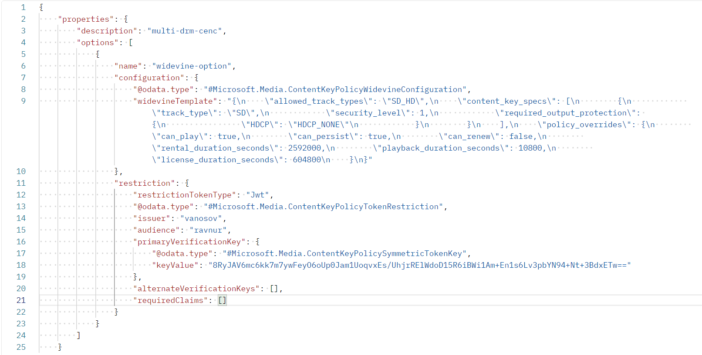

# This instruction is about how to use DRM feature

## Widevine DRM
Widevine DRM technology works on webkit browsers (Chrome, Opera, Firefox) on Windows and macOS.

1. To use it first you need to create ContentKeyPolicy with Widevine option.

2. Then you need to create Streaming Locator for existing asset with appropriate Content Key Policy and Streaming Policy. Streaming Policy should be Predefined_MultiDrmStreaming or Predefined_MultiDrmCencStreaming.

3. Then you need to get streaming paths.

4. For playback testing we can use SHAKA Player. Go To https://shaka-player-demo.appspot.com/demo -> Custom Content and create new player source. Enter streaming url to Manifest URL field.

6. Select DRM pane. In Custom License SErver URL field you need to enter https://widevine-dash.ezdrm.com/widevine-php/widevine-foreignkey.php?pX=[ezdrm_widevine__profile_id]&locatorid=[locator_id]&authorization=[token]

ezdrm_widevine__profile_id - get from Widevine DRM profile in your EZDRM Account:

locator_id - ID of Streaming Locator you have created on step 2

token - JWT token to authorize your access to media.

6. Now media can be played
