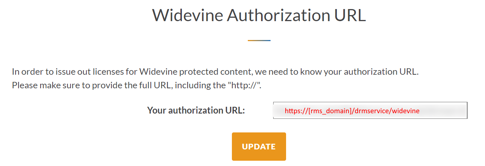
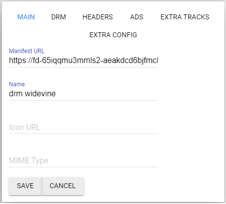
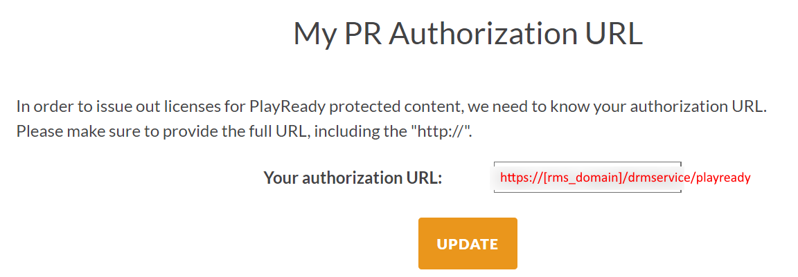
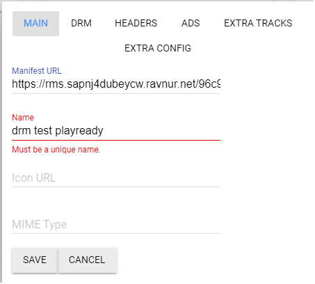
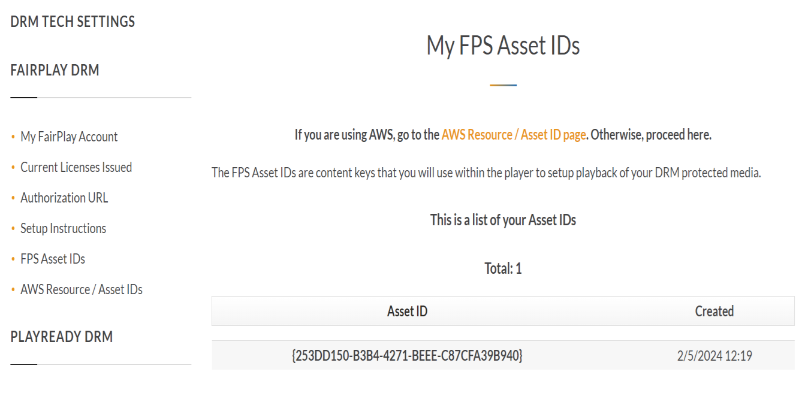

# How to configure and test DRM feature
RMS is compatible with Google Widevine, Microsoft PlayReady, and Apple FairPlay DRM technologies, allowing for their use on respective devices and operating systems. For comprehensive details, please refer to the full [Platform Compatibility](https://www.drm.cloud/platform-compatibility) table. RMS employs EZDRM as its license provider. Therefore, prior to utilizing DRM on RMS, it's necessary to establish an account with [EZDRM](https://www.ezdrm.com) (also available in the [Azure Marketplace](https://azuremarketplace.microsoft.com/en/marketplace/apps/ezdrminc1602008397687.ezdrm_azure?tab=Overview). Once your account is set up, you should configure DRM settings within the RMS Console. To do this, navigate to 'Manage' on your account, enter your EZDRM Username and Password, and then click 'Save'.

Note that these values are cached for 30 min.

## Widevine DRM
Widevine DRM technology can be used on webkit browsers (Chrome, Opera, Firefox) on Windows and macOS.
First of all, you need to configure your EZDRM Widevine account. Enter https://[rms_domain]/drmservice/widevine as Authorization URL.


1. Create Content Key Policy with Widevine option. Set appropriate Issuer, Audience and KeyValue(Base64-encoded string). Additional claims cam be added in Required Claims array if needed.
```JSON
{
    "properties": {
        "description": "multi-drm-cenc",
        "options": [
            {
                "name": "widevine-option",
                "configuration": {
                    "@odata.type": "#Microsoft.Media.ContentKeyPolicyWidevineConfiguration",
                    "widevineTemplate": "{\n    \"allowed_track_types\": \"SD_HD\",\n    \"content_key_specs\": [\n        {\n            \"track_type\": \"SD\",\n            \"security_level\": 1,\n            \"required_output_protection\": {\n                \"HDCP\": \"HDCP_NONE\"\n            }\n        }\n    ],\n    \"policy_overrides\": {\n        \"can_play\": true,\n        \"can_persist\": true,\n        \"can_renew\": false,\n        \"rental_duration_seconds\": 2592000,\n        \"playback_duration_seconds\": 10800,\n        \"license_duration_seconds\": 604800\n    }\n}"
                },
                "restriction": {
                    "restrictionTokenType": "Jwt",
                    "@odata.type": "#Microsoft.Media.ContentKeyPolicyTokenRestriction",
                    "issuer": "ravnur",
                    "audience": "test",
                    "primaryVerificationKey": {
                        "@odata.type": "#Microsoft.Media.ContentKeyPolicySymmetricTokenKey",
                        "keyValue": "8RyJAV6mc6kk7m7ywFeyO6oUp0Jam1UoqvxEs/UhjrRElWdoD15R6iBWi1Am+En1s6Lv3pbYN94+Nt+3BdxETw=="
                    },
                    "alternateVerificationKeys": [],
                    "requiredClaims": []
                }
            }
        ]
    }
}
```
WidevineTemplate field contains streaming restrictions in Json format, details about it can be found [here](https://learn.microsoft.com/en-us/azure/media-services/latest/drm-widevine-license-template-concept).

2. Create Streaming Locator for existing asset with appropriate Content Key Policy and Streaming Policy. Streaming Policy can be Predefined_MultiDrmStreaming or Predefined_MultiDrmCencStreaming.


3. Then you need to get streaming paths (DASH).


4. For playback testing we can use SHAKA Player. Open browser that supports Widevine, go To [Shaka Player Demo](https://shaka-player-demo.appspot.com/) -> Custom Content and create new player source. Enter streaming url to Manifest URL field.

    

5. Select DRM pane. In Custom License Server URL field you need to enter https://widevine-dash.ezdrm.com/widevine-php/widevine-foreignkey.php?pX=[ezdrm_widevine_profile_id]&locatorid=[locator_id]&authorization=[token]


ezdrm_widevine_profile_id - get from Widevine DRM profile in your EZDRM Account (last 6 characters in Porofile Id):


locator_id - ID of Streaming Locator you have created on step 2.

token - JWT token to authorize your access to media. How to generate appropriate token will be explained [below](#how-to-generate-authorization-token).

6. Now media can be played.

## PlayReady DRM
PlayReady DRM technology can be used on Edge browsers on Windows. More details about it you can read [here](https://learn.microsoft.com/en-us/playready/overview/overview).
First of all, you need to configure your EZDRM PlayReady account. Enter https://[rms_domain]/drmservice/playready as Authorization URL.


1. Create Content Key Policy with PlayReady option. Set appropriate Issuer, Audience and KeyValue(Base64-encoded string). Additional claims cam be added in RequiredClaims array if needed.
```JSON
{
    "properties": {
        "description": "multi-drm-cenc",
        "options": [
            {
                "name": "playready-option",
                "configuration": {
                    "@odata.type": "#Microsoft.Media.ContentKeyPolicyPlayReadyConfiguration",
                    "licenses": [
                        {
                            "securityLevel": "SL2000",
                            "licenseType": "Persistent",
                            "contentType": "Unspecified",
                            "allowTestDevices": false,
                            "playRight": {
                                "allowPassingVideoContentToUnknownOutput": "Allowed",
                                "firstPlayExpiration": "P1D",
                                "digitalVideoOnlyContentRestriction": false,
                                "imageConstraintForAnalogComponentVideoRestriction": false,
                                "imageConstraintForAnalogComputerMonitorRestriction": false
                            },
                            "contentKeyLocation": {
                                "@odata.type": "#Microsoft.Media.ContentKeyPolicyPlayReadyContentEncryptionKeyFromHeader"
                            }
                        }
                    ]
                },
                "restriction": {
                    "restrictionTokenType": "Jwt",
                    "@odata.type": "#Microsoft.Media.ContentKeyPolicyTokenRestriction",
                    "issuer": "ravnur",
                    "audience": "test",
                    "primaryVerificationKey": {
                        "@odata.type": "#Microsoft.Media.ContentKeyPolicySymmetricTokenKey",
                        "keyValue": "AopgfzcxUkS9LaQJtUxhlw=="
                    },
                    "alternateVerificationKeys": [],
                    "requiredClaims": []
                }
            }
        ]
    }
}
```
Licenses field contains streaming restriction setting, details about it can be found [here](https://learn.microsoft.com/en-us/playready/overview/license-and-policies).

2. Create Streaming Locator for existing asset with appropriate Content Key Policy and Streaming Policy. Streaming Policy can be Predefined_MultiDrmStreaming or Predefined_MultiDrmCencStreaming.


3. Then you need to get streaming paths (DASH).


4. For playback testing we can use SHAKA Player. Open browser that supports PlayReady (Edge), go To [Shaka Player Demo](https://shaka-player-demo.appspot.com/) -> Custom Content and create new player source. Enter streaming url to Manifest URL field.

    

5. Go to DRM pane. In Custom License Server URL field you need to enter https://playready.ezdrm.com/cency/preauth.aspx?pX=[ezdrm_playready_profile_id]&locatorid=[locator_id]&authorization=[token]


ezdrm_playready_profile_id - get from Widevine DRM profile in your EZDRM Account:


locator_id - ID of Streaming Locator you have created on step 2

token - JWT token to authorize your access to media. How to generate appropriate token will be explained [below](#how-to-generate-authorization-token).

6. Now media can be played.

## FairPlay DRM
Apple FairPlay technology can be used on Apple devices - iOS/ipadOS and with Safari on macOS. First of all, you need to get AFP Certificate from Apple and configure your EZDRM FairPlay account. Instruction on how to do that you can find in your EZDRM account.
Then you need to create AssetID, to do this you need to send Get request http://cpix.ezdrm.com/kalturagetasset.aspx?u=[username]&p=[password] (replace [username] and [password] with your EZDRM credentials). After that you will se AssetID in you EZDRM account.

The AssetID also should be set in your account settings in RMS Console, as described [here](#how-to-configure-and-test-drm-feature).
To play FairPlay DRM source player also requires URL to AFP Certificate, so it should be stored somewhere with public or protected access (e.g. Azure storage blob with SAS or public access).
Then you need to set https://[rms_domain]/drmservice/fairplay as Autorization URL.


1. Create Content Key Policy with FairPlay option. Set appropriate Issuer, Audience and KeyValue(Base64-encoded string). Additional claims cam be added in RequiredClaims array if needed.
```JSON
{
    "properties": {
        "description": "drm-cbcs",
        "options": [
            {
                "name": "fairplay-option",
                "configuration": {
                    "rentalAndLeaseKeyType": "DualExpiry",
                    "@odata.type": "#Microsoft.Media.ContentKeyPolicyFairPlayConfiguration"
                },
                "restriction": {
                    "restrictionTokenType": "Jwt",
                    "@odata.type": "#Microsoft.Media.ContentKeyPolicyTokenRestriction",
                    "issuer": "ravnur",
                    "audience": "test",
                    "primaryVerificationKey": {
                        "@odata.type": "#Microsoft.Media.ContentKeyPolicySymmetricTokenKey",
                        "keyValue": "AopgfzcxUkS9LaQJtUxhlw=="
                    },
                    "alternateVerificationKeys": [],
                    "requiredClaims": []
                }
            }
        ]
    }
}
```

2. Create Streaming Locator for existing asset with appropriate Content Key Policy and Streaming Policy. Streaming Policy should be Predefined_MultiDrmStreaming.


3. Then you need to get streaming paths (HLS).


4.  For playback testing we can use SHAKA Player. Open browser that supports FairPlay, go To [Shaka Player Demo](https://shaka-player-demo.appspot.com/) -> Custom Content and create new player source. Enter streaming url to Manifest URL field.

    

5. Go to DRM pane. In Custom License Server URL field you need to enter https://fps.ezdrm.com/api/licenses/[fairplay_asset_id]?locatorid=[locator_id]&authorization=[token]. In the Custom License Certificate URL field, enter the URL to your Apple FairPlay certificate.

   

fairplay_asset_id - AssetID from your EZDRM FairPlay Account.

locator_id - ID of Streaming Locator you have created on step 2

token - JWT token to authorize your access to media. How to generate appropriate token will be explained [below](#how-to-generate-authorization-token).

6. Now media can be played.

## How to generate Authorization Token
For testing purposes Authorization Token can be generated on [https://jwt.io](https://jwt.io).

1. Put this JSON as payload data:
```JSON
{
    "exp": 1707265900,
    "nbf": 1707244300,
    "iss": "ravnur",
    "aud": "test"
}
```
exp - token expiration date in unix timestamp format (You can edit it right there in payload field and tip will show you readable value).

nbf - token validity start date in unix timestamp format.

iss - issuer value from Content Key Policy.

aud - audience value from Content Key Policy.

If you have any additional required claims in your Content Key Policy, you should add them to payload data.

2. Enter Primary Verification Key, you can get it from Content Key Policy that was used to create Streaming Locator that you want to play. Don't forget to check "secret base64 encoded".


3. Now you can get your token from input field on the left.

RMS supports two additional token claims:
1. "urn:microsoft:azure:mediaservices:maxuses" : "[uses_count]" - this claim allows you to restrict token usage count. When using this feature, requests with tokens whose expiry time is more than one hour away from the time the request is received are rejected with an unauthorized response. You can read more about this claim [here](https://learn.microsoft.com/en-us/previous-versions/media-services/previous/media-services-content-protection-overview#token-replay-prevention).
2. "urn:microsoft:azure:mediaservices:contentkeyidentifier" : "[content_key_id]" - restrict token to be used only with specified Content Key Id from Streaming Locator. If you want to use this claim you also need to add it to appropriate Content Key Policy with empty value. You can read more about this claim [here](https://learn.microsoft.com/en-us/rest/api/media/operations/contentkeyauthorizationpolicyoption).

Please check examples on how to use this claims [here](https://github.com/Azure-Samples/media-services-v3-dotnet/blob/main/ContentProtection/BasicPlayReady/Program.cs).


## NOTES

1. You can create single Content Key Policy with all required DRM options, in this case Streaming Locator created with this Content Key Policy will be playable on any device. But there is restriction related to Streaming Policies: Predefined_MultiDrmStreaming can work with all three DRM technologies, Predefined_MultiDrmCencStreaming can work only with Widevine and PlayReady. This mean that you can create one Content Key Policy with all three DRM tech, but depending on Streaming Policy you've selected when creating Streaming Locator, this locator will work on Apple devices or not. Note that if you use same Streaming Locator for all three DRM technologies, you should use DASH path for Widevine and PlayReady and HLS for FairPlay.
