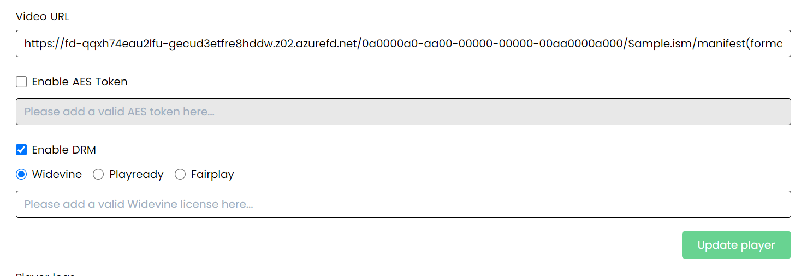
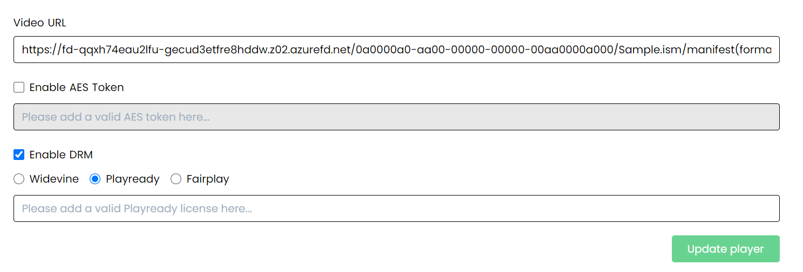
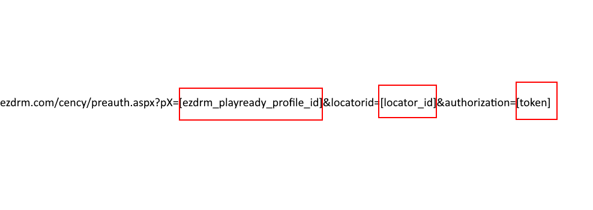
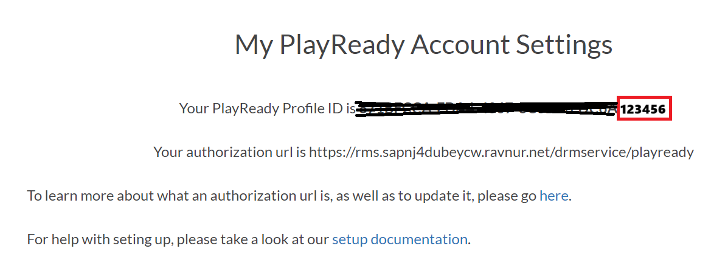
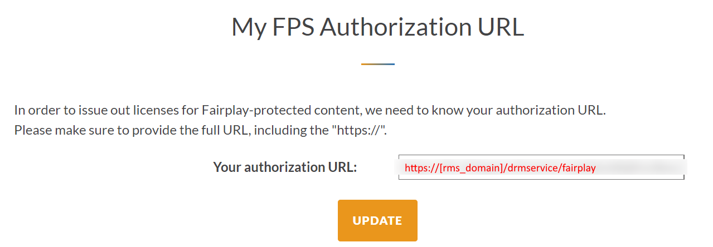
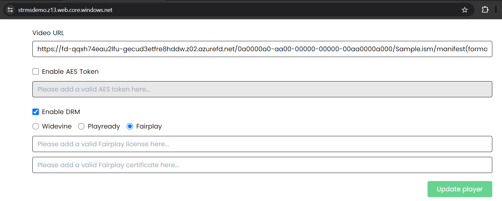
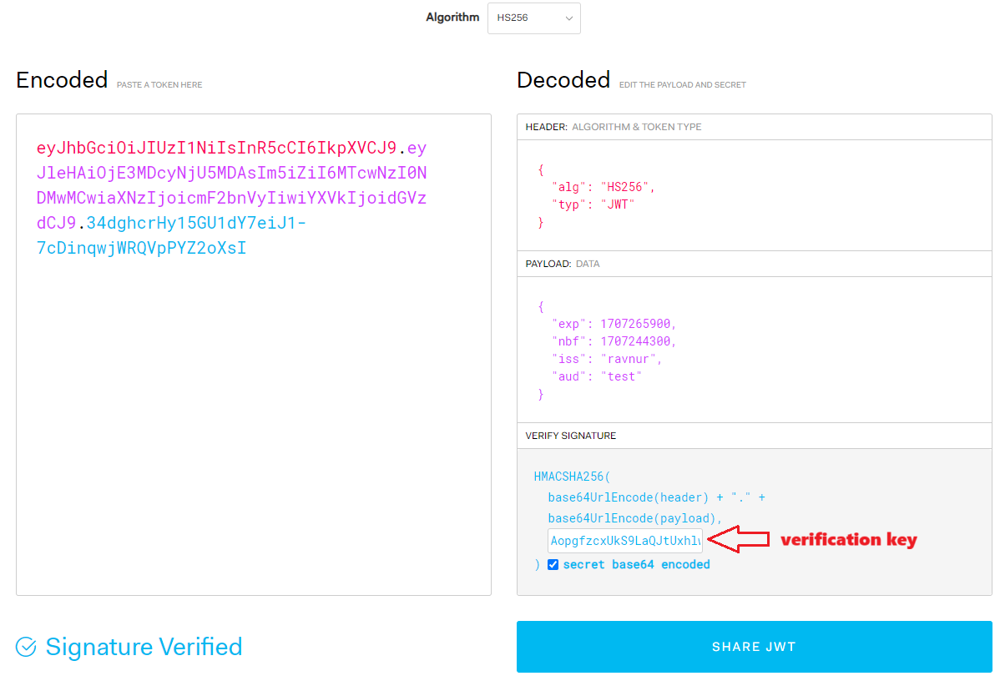

# How to configure and test the DRM feature
RMS is compatible with Google Widevine, Microsoft PlayReady, and Apple FairPlay DRM technologies, allowing for their use on respective devices and operating systems. For more details, please refer to the full [Platform Compatibility](https://www.drm.cloud/platform-compatibility) table. 

## Prerequisites
1. Get an account with [EZDRM](https://www.ezdrm.com). It is also available in the [Azure Marketplace](https://azuremarketplace.microsoft.com/en/marketplace/apps/ezdrminc1602008397687.ezdrm_azure?tab=Overview). 
2. Configure DRM settings within the RMS Console. To do this, navigate to 'Manage' on your account, enter your EZDRM Username and Password, and then click 'Save'.

Note that these values are cached for 30 min.

## Select an Approach for DRM Configuration

When configuring DRM for your media, you have several options to consider:

[Widevine DRM](#widevine-drm)

[PlayReady DRM](#playready-drm)

[FairPlay DRM](#fairplay-drm)

[Universal DRM Setup](#universal-drm-setup-optional-simplified-path)

Each DRM technology is compatible with specific devices and browsers. You can choose to set up one, two, or all three DRM technologies to ensure broad compatibility. Get acquainted with the steps necessary for each required option and select your approach.

### DRM Compatibility Notes for Streaming Locator Setup

You can create a single Content Key Policy with all the required DRM options. You'll create a Streaming Locator with this Content Key Policy, followed by creating Paths (URLs). A URL is compiled into a link that will be playable on any device. However, there are restrictions with Streaming Policies:

- `Predefined_MultiDrmStreaming`: Compatible with all three DRM technologies.
- `Predefined_MultiDrmCencStreaming`: Works only with Widevine and PlayReady.
Depending on the selected Streaming Policy, the locator's compatibility with Apple devices varies. For full compatibility, use DASH for Widevine and PlayReady, and HLS for FairPlay.
---

## Widevine DRM
Widevine DRM technology can be used on webkit browsers (Chrome, Opera, Firefox) on Windows and macOS, and Edge on Android.

1. Configure your EZDRM Widevine account. Enter _**https://[rms_domain]/drmservice/widevine**_ as Authorization URL.
> [!Note]
>  Make sure to replace **[rms_domain]** with your RMS streaming domain from RMS Console > Manage 
> 


2. Create a Content Key Policy with the Widevine option. Set appropriate values:
   - Issuer
   - Audience
   - KeyValue (Base64-encoded string).
     
Additional claims may be added to the `"requiredClaims": []`.
```JSON
{
    "properties": {
        "description": "multi-drm-cenc",
        "options": [
            {
                "name": "widevine-option",
                "configuration": {
                    "@odata.type": "#Microsoft.Media.ContentKeyPolicyWidevineConfiguration",
                    "widevineTemplate": "{\n    \"allowed_track_types\": \"SD_HD\",\n    \"content_key_specs\": [\n        {\n            \"track_type\": \"SD\",\n            \"security_level\": 1,\n            \"required_output_protection\": {\n                \"HDCP\": \"HDCP_NONE\"\n            }\n        }\n    ],\n    \"policy_overrides\": {\n        \"can_play\": true,\n        \"can_persist\": true,\n        \"can_renew\": false,\n        \"rental_duration_seconds\": 2592000,\n        \"playback_duration_seconds\": 10800,\n        \"license_duration_seconds\": 604800\n    }\n}"
                },
                "restriction": {
                    "restrictionTokenType": "Jwt",
                    "@odata.type": "#Microsoft.Media.ContentKeyPolicyTokenRestriction",
                    "issuer": "ravnur",
                    "audience": "test",
                    "primaryVerificationKey": {
                        "@odata.type": "#Microsoft.Media.ContentKeyPolicySymmetricTokenKey",
                        "keyValue": "8RyJAV6mc6kk7m7ywFeyO6oUp0Jam1UoqvxEs/UhjrRElWdoD15R6iBWi1Am+En1s6Lv3pbYN94+Nt+3BdxETw=="
                    },
                    "alternateVerificationKeys": [],
                    "requiredClaims": []
                }
            }
        ]
    }
}
```
`WidevineTemplate` field contains streaming restrictions in JSON format, learn more [here](https://learn.microsoft.com/en-us/azure/media-services/latest/drm-widevine-license-template-concept).

3. Create a Streaming Locator for existing assets with the appropriate Content Key Policy and Streaming Policy.
   Streaming Policy can be `Predefined_MultiDrmStreaming` or `Predefined_MultiDrmCencStreaming`. [Learn more](#drm-compatibility-notes-for-streaming-locator-setup).
```JSON
{
    "properties": {
        "assetName": "output-yourAsset",
        "streamingPolicyName": "Predefined_MultiDrmCencStreaming",
        "defaultContentKeyPolicyName": "yourPolicy"
    }
}
```


4. Get streaming paths (DASH). This is a response sample:
```JSON   
{
    "streamingPaths": [
        {
            "streamingProtocol": "Dash",
            "encryptionScheme": "CommonEncryptionCenc",
            "paths": [
                "/0a0000a0-aa00-00000-00000-00aa0000a000/Sample.ism/manifest(format-mpd-time-cmaf,encryption-cenc)"
            ]
        }
    ],
    "downloadPaths": []
}
```

5. For playback testing we can use [Ravnur Player](https://github.com/Ravnur-Inc/ravplayer):
   
   - Open a browser that supports Widevine, e.g. - Chrome.
   
   - Go to [Ravnur Player Demo](https://strmsdemo.z13.web.core.windows.net/)
   
   - Enter the streaming URL (RMS domain and `paths`) in the Video URL field.

    

6. Select "Enable DRM". In the **"Widevine license"** field, enter the following URL, replacing the placeholders with the appropriate values:
  
```
https://widevine-dash.ezdrm.com/widevine-php/widevine-foreignkey.php?pX=[ezdrm_widevine_profile_id]&locatorid=[locator_id]&authorization=[token]
```
 

`ezdrm_widevine_profile_id` - Last 6 characters of the Widevine DRM profile ID from your EZDRM account.

`locator_id` - ID of the Streaming Locator created in step 3.

`token` - JWT token for media access authorization. [Click here](#how-to-generate-an-authorization-token) to see the instructions.
> [!Note]
> Ensure all values are replaced correctly before using the URL.


7. Press on "Update player". With the composed URL, you can now play the media securely. The URL enables the decryption of the content, ensuring it is properly protected and accessible for authorized playback.
---

## PlayReady DRM
PlayReady DRM technology can be used on Edge browsers on Windows. Learn more [here](https://learn.microsoft.com/en-us/playready/overview/overview).

1. Configure your EZDRM PlayReady account. Enter _**https://[rms_domain]/drmservice/playready**_ as Authorization URL. 
> [!Note]
>  Make sure to replace **[rms_domain]** with your RMS streaming domain from RMS Console > Manage 
> 


2. Create a Content Key Policy with the PlayReady option. Set appropriate values:
   - Issuer
   - Audience
   - KeyValue (Base64-encoded string).
  
   Additional claims may be added to the `"requiredClaims": []`.
```JSON
{
    "properties": {
        "description": "multi-drm-cenc",
        "options": [
            {
                "name": "playready-option",
                "configuration": {
                    "@odata.type": "#Microsoft.Media.ContentKeyPolicyPlayReadyConfiguration",
                    "licenses": [
                        {
                            "securityLevel": "SL2000",
                            "licenseType": "Persistent",
                            "contentType": "Unspecified",
                            "allowTestDevices": false,
                            "playRight": {
                                "allowPassingVideoContentToUnknownOutput": "Allowed",
                                "firstPlayExpiration": "P1D",
                                "digitalVideoOnlyContentRestriction": false,
                                "imageConstraintForAnalogComponentVideoRestriction": false,
                                "imageConstraintForAnalogComputerMonitorRestriction": false
                            },
                            "contentKeyLocation": {
                                "@odata.type": "#Microsoft.Media.ContentKeyPolicyPlayReadyContentEncryptionKeyFromHeader"
                            }
                        }
                    ]
                },
                "restriction": {
                    "restrictionTokenType": "Jwt",
                    "@odata.type": "#Microsoft.Media.ContentKeyPolicyTokenRestriction",
                    "issuer": "ravnur",
                    "audience": "test",
                    "primaryVerificationKey": {
                        "@odata.type": "#Microsoft.Media.ContentKeyPolicySymmetricTokenKey",
                        "keyValue": "AopgfzcxUkS9LaQJtUxhlw=="
                    },
                    "alternateVerificationKeys": [],
                    "requiredClaims": []
                }
            }
        ]
    }
}
```
   The `licenses` field contains a streaming restriction setting, learn more [here](https://learn.microsoft.com/en-us/playready/overview/license-and-policies).

3. Create a Streaming Locator for existing assets with the appropriate Content Key Policy and Streaming Policy. [Learn more](#drm-compatibility-notes-for-streaming-locator-setup).

   The streaming Policy can be `Predefined_MultiDrmStreaming` or `Predefined_MultiDrmCencStreaming`.

```JSON
{
    "properties": {
        "assetName": "output-yourAsset",
        "streamingPolicyName": "Predefined_MultiDrmCencStreaming",
        "defaultContentKeyPolicyName": "yourPolicy"
    }
}
```

4. Get streaming paths (DASH).
```JSON   
{
    "streamingPaths": [
        {
            "streamingProtocol": "Dash",
            "encryptionScheme": "CommonEncryptionCenc",
            "paths": [
                "/0a0000a0-aa00-00000-00000-00aa0000a000/Sample.ism/manifest(format-mpd-time-cmaf,encryption-cenc)"
            ]
        }
    ],
    "downloadPaths": []
}
```

5. For playback testing we can use [Ravnur Player](https://github.com/Ravnur-Inc/ravplayer):
   
   - Open a browser that supports PlayReady, e.g. - Edge on Windows
   
   - Go to [Ravnur Player Demo](https://strmsdemo.z13.web.core.windows.net/)
   
   - Enter the streaming URL (RMS domain and `paths`) in the Video URL field
  



6. Select "Enable DRM". In the **"Playready license"** field, enter the following URL, replacing the placeholders with the appropriate values:


 ```
https://playready.ezdrm.com/cency/preauth.aspx?pX=[ezdrm_playready_profile_id]&locatorid=[locator_id]&authorization=[token]
```

  
   

`ezdrm_playready_profile_id` - get from Widevine DRM profile in your EZDRM Account


`locator_id` - ID of the Streaming Locator you have created in step 3

`token` - JWT token to authorize your access to media. [Click here](#how-to-generate-an-authorization-token) to see the instructions.
> [!Note]
> Ensure all values are replaced correctly before using the URL.

7. Press the "Update player".
   With the composed URL, you can now play the media securely. The URL enables the decryption of the content, ensuring it is properly protected and accessible for authorized playback.
---
## FairPlay DRM
Apple FairPlay technology can be used on Apple devices - iOS/iPadOS and with Safari on macOS. 

### Prerequisites
- Get an AFP Certificate from Apple and configure your EZDRM FairPlay account. Instructions can be found in your EZDRM account.
> [!Note]
> When you upload the AFP Certificate, please ensure that you specify the following URL as AUTH URL: _**https://[rms_domain]/drmservice/fairplay**_
- Create AssetID: send a Get request 
   http://cpix.ezdrm.com/kalturagetasset.aspx?u=[username]&p=[password]. Make sure to replace _**[username]**_ and _**[password]**_ with your EZDRM credentials. After that, you will see AssetID in your EZDRM account.

- The AssetID should be set in your account settings in the _RMS Console > Manage > DRM Settings > FairPay Asset ID_.

> [!Note]
> The Asset ID should be generated AFTER the AFP Certificate is uploaded.
- Generate a URL to the AFP Certificate and store it with limited or protected access (e.g., Azure storage blob with SAS or restricted access).

Continue with DRM encryption configuration:
1. Set _**https://[rms_domain]/drmservice/fairplay**_ as Authorization URL. 
> [!Note]
>  Make sure to replace **[rms_domain]** with your RMS streaming domain from RMS Console > Manage 
> 




2. Create a Content Key Policy with the FairPlay option. Set appropriate values:
   - Issuer
   - Audience
   - KeyValue (Base64-encoded string).

Additional claims may be added to the `"requiredClaims": []`.
```JSON
{
    "properties": {
        "description": "drm-cbcs",
        "options": [
            {
                "name": "fairplay-option",
                "configuration": {
                    "rentalAndLeaseKeyType": "DualExpiry",
                    "@odata.type": "#Microsoft.Media.ContentKeyPolicyFairPlayConfiguration"
                },
                "restriction": {
                    "restrictionTokenType": "Jwt",
                    "@odata.type": "#Microsoft.Media.ContentKeyPolicyTokenRestriction",
                    "issuer": "ravnur",
                    "audience": "test",
                    "primaryVerificationKey": {
                        "@odata.type": "#Microsoft.Media.ContentKeyPolicySymmetricTokenKey",
                        "keyValue": "AopgfzcxUkS9LaQJtUxhlw=="
                    },
                    "alternateVerificationKeys": [],
                    "requiredClaims": []
                }
            }
        ]
    }
}
```

3. Create a Streaming Locator for an existing asset with the appropriate Content Key Policy and Streaming Policy. [Learn more](#drm-compatibility-notes-for-streaming-locator-setup).
   
    The streaming Policy should be `Predefined_MultiDrmStreaming`.

```JSON
{
    "properties": {
        "assetName": "output-yourAsset",
        "streamingPolicyName": "Predefined_MultiDrmCencStreaming",
        "defaultContentKeyPolicyName": "yourPolicy"
    }
}
```

4. Get streaming paths (HLS).
```JSON   
{
    "streamingPaths": [
        {
            "streamingProtocol": "HLS",
            "encryptionScheme": "CommonEncryptionCenc",
            "paths": [
                "/0a0000a0-aa00-00000-00000-00aa0000a000/Sample.ism/manifest(format-mpd-time-cmaf,encryption-cenc)"
            ]
        }
    ],
    "downloadPaths": []
}
```
5. For playback testing we can use [Ravnur Player](https://github.com/Ravnur-Inc/ravplayer):
   
   - Open a browser that supports FairPlay, e.g. - Safari on MacOS.
   
   - Go to [Ravnur Player Demo](https://strmsdemo.z13.web.core.windows.net/)
   
   - Enter the streaming URL (RMS domain and `paths`) in the Video URL field.
   


6. Select "Enable DRM". Insert 2 fields:
   - Fairplay license
   - Fairplay certificate
    
  - In the **"Fairplay license"** field, enter the following URL, replacing the placeholders with the appropriate values:
   
 ```
  https://fps.ezdrm.com/api/licenses/[fairplay_asset_id]?locatorid=[locator_id]&authorization=[token]
```
   

`fairplay_asset_id` - AssetID from your EZDRM FairPlay Account.

`locator_id` - ID of the Streaming Locator you have created in step 3

`token` - JWT token to authorize your access to media. [Click here](#how-to-generate-an-authorization-token) to see the instructions.

> [!Note]
> Ensure all values are replaced correctly before using the URL.

  - Finally, enter the URL to your Apple FairPlay certificate in the 'Fairplay certificate' field.

7. Press "Update player". With the composed URL, you can now play the media securely. The URL enables the decryption of the content, ensuring it is properly protected and accessible for authorized playback.
---
### Universal DRM Setup (Optional, Simplified Path)

You can create a single Content Key Policy and shared Streaming Locator that supports all three DRM technologies — Widevine, PlayReady, and FairPlay. This simplifies the setup process, however, some steps are obligatory for each DRM, so you will still need to follow the  guides above.

1. Step 1 is a configuration of your EZDRM for each separate kind of DRM. Navigate to the corresponding guide ([Widevine](#widevine-drm), [PlayReady DRM](#playready-drm), and [FairPlay DRM](#fairplay-drm)) and do not skip this step.

2. Create a single Content Key Policy that would be universal for PlayReady, WideWine, and FairPlay. You should set up the `restriction` separately for each of these kinds. Here is an example configuration:
 
 Set appropriate values:
- Issuer
- Audience
- KeyValue (Base64-encoded string).

Additional claims can be added in the `"requiredClaims": []` array if needed.
```JSON
"properties": {
        "description": "all-in-one",
        "options": [
            {
                "name": "widevine-option",
                "configuration": {
                    "@odata.type": "#Microsoft.Media.ContentKeyPolicyWidevineConfiguration",
                    "widevineTemplate": "{\n    \"allowed_track_types\": \"SD_HD\",\n    \"content_key_specs\": [\n        {\n            \"track_type\": \"SD\",\n            \"security_level\": 1,\n            \"required_output_protection\": {\n                \"HDCP\": \"HDCP_NONE\"\n            }\n        }\n    ],\n    \"policy_overrides\": {\n        \"can_play\": true,\n        \"can_persist\": true,\n        \"can_renew\": false,\n        \"rental_duration_seconds\": 2592000,\n        \"playback_duration_seconds\": 10800,\n        \"license_duration_seconds\": 604800\n    }\n}"
                },
                "restriction": {
                    "restrictionTokenType": "Jwt",
                    "@odata.type": "#Microsoft.Media.ContentKeyPolicyTokenRestriction",
                    "issuer": "ravnur",
                    "audience": "test",
                    "primaryVerificationKey": {
                        "@odata.type": "#Microsoft.Media.ContentKeyPolicySymmetricTokenKey",
                        "keyValue": "8RyJAV6mc6kk7m7ywFeyO6oUp0Jam1UoqvxEs/UhjrRElWdoD15R6iBWi1Am+En1s6Lv3pbYN94+Nt+3BdxETw=="
                    },
                    "alternateVerificationKeys": [],
                    "requiredClaims": []
                }
            },
            {
                "name": "playready-option",
                "configuration": {
                    "@odata.type": "#Microsoft.Media.ContentKeyPolicyPlayReadyConfiguration",
                    "licenses": [
                        {
                            "securityLevel": "SL2000",
                            "licenseType": "Persistent",
                            "contentType": "Unspecified",
                            "allowTestDevices": false,
                            "playRight": {
                                "allowPassingVideoContentToUnknownOutput": "Allowed",
                                "firstPlayExpiration": "P1D",
                                "digitalVideoOnlyContentRestriction": false,
                                "imageConstraintForAnalogComponentVideoRestriction": false,
                                "imageConstraintForAnalogComputerMonitorRestriction": false
                            },
                            "contentKeyLocation": {
                                "@odata.type": "#Microsoft.Media.ContentKeyPolicyPlayReadyContentEncryptionKeyFromHeader"
                            }
                        }
                    ]
                },
                "restriction": {
                    "restrictionTokenType": "Jwt",
                    "@odata.type": "#Microsoft.Media.ContentKeyPolicyTokenRestriction",
                    "issuer": "ravnur",
                    "audience": "test",
                    "primaryVerificationKey": {
                        "@odata.type": "#Microsoft.Media.ContentKeyPolicySymmetricTokenKey",
                        "keyValue": "AopgfzcxUkS9LaQJtUxhlw=="
                    },
                    "alternateVerificationKeys": [],
                    "requiredClaims": []
                }
            },
            {
                "name": "fairplay-option",
                "configuration": {
                    "rentalAndLeaseKeyType": "DualExpiry",
                    "@odata.type": "#Microsoft.Media.ContentKeyPolicyFairPlayConfiguration"
                },
                "restriction": {
                    "restrictionTokenType": "Jwt",
                    "@odata.type": "#Microsoft.Media.ContentKeyPolicyTokenRestriction",
                    "issuer": "ravnur",
                    "audience": "test",
                    "primaryVerificationKey": {
                        "@odata.type": "#Microsoft.Media.ContentKeyPolicySymmetricTokenKey",
                        "keyValue": "AopgfzcxUkS9LaQJtUxhlw=="
                    },
                    "alternateVerificationKeys": [],
                    "requiredClaims": []
                }
            }
        ]
    }
}
```
There are some considerations:
- PlayReady: The `licenses` field contains a streaming restriction setting, learn more [here](https://learn.microsoft.com/en-us/playready/overview/license-and-policies).
- Widevine: `WidevineTemplate` field contains streaming restrictions in JSON format, learn more [here](https://learn.microsoft.com/en-us/azure/media-services/latest/drm-widevine-license-template-concept).

3. Use a Content Key Policy from Step 2 and StreamingPolicy `Predefined_MultiDrmStreaming` to create a shared Streaming Locator for your media assets. This ensures that all DRM technologies are supported through a single locator. [Learn more](#drm-compatibility-notes-for-streaming-locator-setup).
```JSON
{
    "properties": {
        "assetName": "output-yourAsset",
        "streamingPolicyName": "Predefined_MultiDrmStreaming",
        "defaultContentKeyPolicyName": "yourPolicy"
    }
}
```
>[!Note]
> When you create a Streaming Locator, you may find two Content Key IDs corresponding to two different encryption schemes: "cenc" for DASH and "cbcs" for HLS, each with its own unique ID value.

4. Generate Streaming Paths.
   
The following JSON illustrates how the result can look with generated paths for both DASH and HLS:
```JSON
{
    "streamingPaths": [
        {
            "streamingProtocol": "HLS",
            "encryptionScheme": "CommonEncryptionCbcs",
            "paths": [
                "/0a0000a0-aa00-00000-00000-00aa0000a000/Sample.ism/manifest(format=m3u8-aapl,encryption-cbcs)"
            ]
        },
        {
            "streamingProtocol": "DASH",
            "encryptionScheme": "CommonEncryptionCenc",
            "paths": [
                "/0a0000a0-aa00-00000-00000-00aa0000a000/Sample.ism/manifest(format=mpd-time-cmaf,encryption-cenc)"
            ]
        }
    ],
    "downloadPaths": []
}
```
You have completed steps 2-4 and obtained a universal Content Key Policy and Streaming Locator, so go straight into step 5 of each corresponding guide: [Widevine](#widevine-drm), [PlayReady DRM](#playready-drm) and [FairPlay DRM](#fairplay-drm).

5. Paste a streaming URL to a demo player.
6. Enable DRM and compose a corresponding link for each separate DRM option. 
   For this step, you are guided to change some values of the URL to complete the setting.
   
   A single `locator_id` can be used for each link. Then, finish composing the link using each corresponding guide.


This optional path provides a simplified, all-in-one DRM configuration and testing solution.

## How to generate an Authorization Token
An Authorization Token can be generated on [https://jwt.io](https://jwt.io). You can use other software for this purpose,

1. Put this JSON into the 'PAYLOAD: DATA' box:
```JSON
{
    "exp": 1707265900,
    "nbf": 1707244300,
    "iss": "ravnur",
    "aud": "test"
}
```
`exp` - token expiration date in [Unix timestamp format](https://www.unixtimestamp.com/). jwt.io will display a hint in a standard calendar format once you point your cursor to the value.

`nbf` - token validity start date in Unix timestamp format.

`iss` - issuer value from Content Key Policy.

`aud` - audience value from Content Key Policy.

> [!Note]
> If you have any additional required claims in your Content Key Policy, you should add them to payload data.

2. Enter the Primary Verification Key from the Content Key Policy. This key was used to create the Streaming Locator you want to play. Don't forget to check "secret base64 encoded".


3. Now you can get your token from the input field on the left.

RMS supports two additional token claims:
- `urn:microsoft:azure:mediaservices:maxuses` : "[uses_count]" - this claim allows you to restrict token usage count. When using this feature, requests with tokens whose expiry time is more than one hour away from the time the request is received are rejected with an unauthorized response. Learn more [here](https://learn.microsoft.com/en-us/previous-versions/media-services/previous/media-services-content-protection-overview#token-replay-prevention).
- `urn:microsoft:azure:mediaservices:contentkeyidentifier` : "[content_key_id]" - restrict token to be used only with Content Key ID for "cenc" or "cbcs" from Streaming Locator created earlier. If you want to use this claim you also need to add it to the appropriate Content Key Policy with   `"claimValue": ""`. Learn more [here](https://learn.microsoft.com/en-us/rest/api/media/operations/contentkeyauthorizationpolicyoption).

Please check examples on how to use these claims [here](https://github.com/Azure-Samples/media-services-v3-dotnet/blob/main/ContentProtection/BasicPlayReady/Program.cs).
