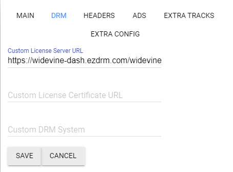
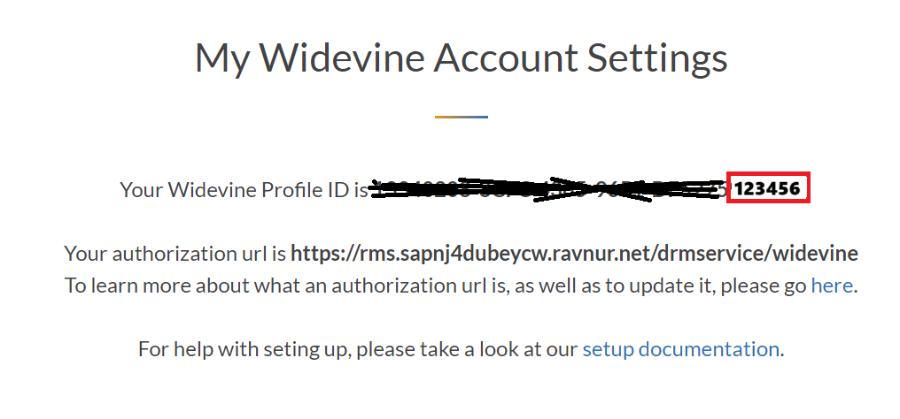
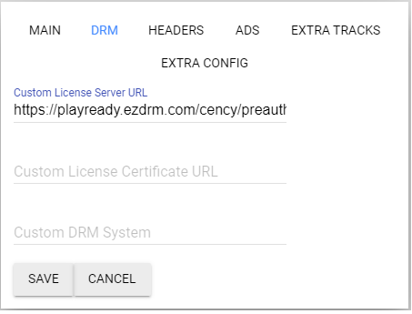
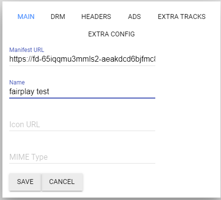
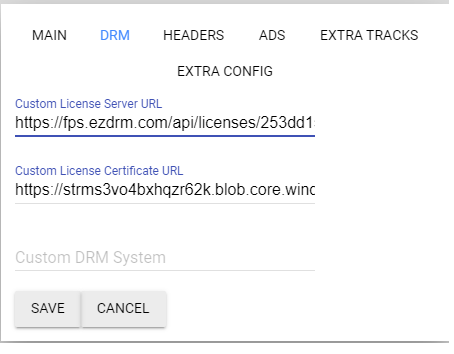

# This instruction is about how to use DRM feature
RMS supports 3 Google Widevine, Microsof tPlayReady and Apple FairPlay DRM technologies, each of them can be used on appropriate devices and operation systems. You can find full Platform compatibility table here: https://www.drm.cloud/platform-compatibility.

## Widevine DRM
Widevine DRM technology can be used on webkit browsers (Chrome, Opera, Firefox) on Windows and macOS.

1. To use it first you need to create ContentKeyPolicy with Widevine option. Set appropriate Issuer, Audience and KeyValue(Base64-encoded string). Additional claims cam be added in RequiredClaims array if needed.
```JSON
{
    "properties": {
        "description": "multi-drm-cenc",
        "options": [
            {
                "name": "widevine-option",
                "configuration": {
                    "@odata.type": "#Microsoft.Media.ContentKeyPolicyWidevineConfiguration",
                    "widevineTemplate": "{\n    \"allowed_track_types\": \"SD_HD\",\n    \"content_key_specs\": [\n        {\n            \"track_type\": \"SD\",\n            \"security_level\": 1,\n            \"required_output_protection\": {\n                \"HDCP\": \"HDCP_NONE\"\n            }\n        }\n    ],\n    \"policy_overrides\": {\n        \"can_play\": true,\n        \"can_persist\": true,\n        \"can_renew\": false,\n        \"rental_duration_seconds\": 2592000,\n        \"playback_duration_seconds\": 10800,\n        \"license_duration_seconds\": 604800\n    }\n}"
                },
                "restriction": {
                    "restrictionTokenType": "Jwt",
                    "@odata.type": "#Microsoft.Media.ContentKeyPolicyTokenRestriction",
                    "issuer": "ravnur",
                    "audience": "test",
                    "primaryVerificationKey": {
                        "@odata.type": "#Microsoft.Media.ContentKeyPolicySymmetricTokenKey",
                        "keyValue": "8RyJAV6mc6kk7m7ywFeyO6oUp0Jam1UoqvxEs/UhjrRElWdoD15R6iBWi1Am+En1s6Lv3pbYN94+Nt+3BdxETw=="
                    },
                    "alternateVerificationKeys": [],
                    "requiredClaims": []
                }
            }
        ]
    }
}
```
WidevineTemplate field contains streaming restrictions in Json format, details about it can be found here https://learn.microsoft.com/en-us/azure/media-services/latest/drm-widevine-license-template-concept

2. Create Streaming Locator for existing asset with appropriate Content Key Policy and Streaming Policy. Streaming Policy should be Predefined_MultiDrmStreaming or Predefined_MultiDrmCencStreaming.


3. Then you need to get streaming paths.


4. For playback testing we can use SHAKA Player. Open browser that supports Widevine, go To https://shaka-player-demo.appspot.com/demo -> Custom Content and create new player source. Enter streaming url to Manifest URL field.

    

5. Select DRM pane. In Custom License Server URL field you need to enter https://widevine-dash.ezdrm.com/widevine-php/widevine-foreignkey.php?pX=[ezdrm_widevine_profile_id]&locatorid=[locator_id]&authorization=[token]


![#1589F0]ezdrm_widevine_profile_id`#1589F0` - get from Widevine DRM profile in your EZDRM Account:


![#1589F0]locator_id`#1589F0` - ID of Streaming Locator you have created on step 2

![#1589F0]token`#1589F0` - JWT token to authorize your access to media. How to generate appropriate token will be explained below.

6. Now media can be played.

## PlayReady DRM
PlayReady DRM technology can be used on Edge browser on Windows. More details about it you can read here https://learn.microsoft.com/en-us/playready/overview/overview.

1. Create Content Key Policy with PlayReady option. Set appropriate Issuer, Audience and KeyValue(Base64-encoded string). Additional claims cam be added in RequiredClaims array if needed.
```JSON
{
    "properties": {
        "description": "multi-drm-cenc",
        "options": [
            {
                "name": "playready-option",
                "configuration": {
                    "@odata.type": "#Microsoft.Media.ContentKeyPolicyPlayReadyConfiguration",
                    "licenses": [
                        {
                            "securityLevel": "SL2000",
                            "licenseType": "Persistent",
                            "contentType": "Unspecified",
                            "allowTestDevices": false,
                            "playRight": {
                                "allowPassingVideoContentToUnknownOutput": "Allowed",
                                "firstPlayExpiration": "P1D",
                                "digitalVideoOnlyContentRestriction": false,
                                "imageConstraintForAnalogComponentVideoRestriction": false,
                                "imageConstraintForAnalogComputerMonitorRestriction": false
                            },
                            "contentKeyLocation": {
                                "@odata.type": "#Microsoft.Media.ContentKeyPolicyPlayReadyContentEncryptionKeyFromHeader"
                            }
                        }
                    ]
                },
                "restriction": {
                    "restrictionTokenType": "Jwt",
                    "@odata.type": "#Microsoft.Media.ContentKeyPolicyTokenRestriction",
                    "issuer": "ravnur",
                    "audience": "test",
                    "primaryVerificationKey": {
                        "@odata.type": "#Microsoft.Media.ContentKeyPolicySymmetricTokenKey",
                        "keyValue": "AopgfzcxUkS9LaQJtUxhlw=="
                    },
                    "alternateVerificationKeys": [],
                    "requiredClaims": []
                }
            }
        ]
    }
}
```
Licenses filed contains streaming restriction setting, details about it can be found here https://learn.microsoft.com/en-us/playready/overview/license-and-policies

2. Create Streaming Locator for existing asset with appropriate Content Key Policy and Streaming Policy. Streaming Policy should be Predefined_MultiDrmStreaming or Predefined_MultiDrmCencStreaming.


3. Then you need to get streaming paths.


4. For playback testing we can use SHAKA Player. Open browser that supports (Edge) PlayReady, go To https://shaka-player-demo.appspot.com/demo -> Custom Content and create new player source. Enter streaming url to Manifest URL field.

    

5. Select DRM pane. In Custom License Server URL field you need to enter https://playready.ezdrm.com/cency/preauth.aspx?pX=[ezdrm_playready_profile_id]&locatorid=[locator_id]&authorization=[token]


![#1589F0]ezdrm_playready_profile_id`#1589F0` - get from Widevine DRM profile in your EZDRM Account:


![#1589F0]locator_id`#1589F0` - ID of Streaming Locator you have created on step 2

![#1589F0]token`#1589F0` - JWT token to authorize your access to media. How to generate appropriate token will be explained below.

6. Now media can be played.

## FairPlay DRM
Apple FairPlay technology can be used on Apple devices - iOS/ipadOS and Safari on macOS. First of all, you need to get AFP Certificate from Apple and configure your EZDRM FairPlay account. Instruction about how to do that you can find in your EZDRM account.

1. Create Content Key Policy with FairPlay option. Set appropriate Issuer, Audience and KeyValue(Base64-encoded string). Additional claims cam be added in RequiredClaims array if needed.
```JSON
{
    "properties": {
        "description": "drm-cbcs",
        "options": [
            {
                "policyOptionId": "63e86438-adbe-4af4-37d5-08dc2690c330",
                "name": "fairplay-option",
                "configuration": {
                    "rentalAndLeaseKeyType": "DualExpiry",
                    "@odata.type": "#Microsoft.Media.ContentKeyPolicyFairPlayConfiguration"
                },
                "restriction": {
                    "restrictionTokenType": "Jwt",
                    "@odata.type": "#Microsoft.Media.ContentKeyPolicyTokenRestriction",
                    "issuer": "ravnur",
                    "audience": "test",
                    "primaryVerificationKey": {
                        "@odata.type": "#Microsoft.Media.ContentKeyPolicySymmetricTokenKey",
                        "keyValue": "AopgfzcxUkS9LaQJtUxhlw=="
                    },
                    "alternateVerificationKeys": [],
                    "requiredClaims": []
                }
            }
        ]
    }
}
```

2. Create Streaming Locator for existing asset with appropriate Content Key Policy and Streaming Policy. Streaming Policy should be or Predefined_MultiDrmStreaming.


3. Then you need to get streaming paths.


4.  For playback testing we can use SHAKA Player. Open browser that supports FairPlay, go To https://shaka-player-demo.appspot.com/demo -> Custom Content and create new player source. Enter streaming url to Manifest URL field.


5. Select DRM pane. In Custom License Server URL field you need to enter https://fps.ezdrm.com/api/licenses/253dd150-b3b4-4271-beee-c87cfa39b94?locatorid=[locator_id]&authorization=[token], in Custom License Certificate URL enter https://strms3vo4bxhqzr62k.blob.core.windows.net/drm/fairplay.cer

   

![#1589F0]locator_id`#1589F0` - ID of Streaming Locator you have created on step 2

![#1589F0]token`#1589F0` - JWT token to authorize your access to media. How to generate appropriate token will be explained below.

6. Now media can be played.

## How to generate Authorization Token
For testing purposes Authorization Token can be generated on https://jwt.io/

1. Put this JSON as payload data:
```JSON
{
    "exp": 1707265900,
    "nbf": 1707244300,
    "iss": "ravnur",
    "aud": "test"
}
```
![#1589F0]exp`#1589F0` - token expiration date in unix timestamp format (You can edit it right there in payload field and tip will showl you readable value).
![#1589F0]nbf`#1589F0` - token validity start date in unix timestamp format.
![#1589F0]iss`#1589F0` - issuer value from Content Key Policy.
![#1589F0]aud`#1589F0` - audience value from Content Key Policy.

If you have any additional Required CLaims in your Content Key Policy, you should add it payload data.

2. Enter Primary Verification Key, you can get it from Content Key Policy that was used to create streaming Locator that you want to play


3. Now you can get your token from input field on left.
