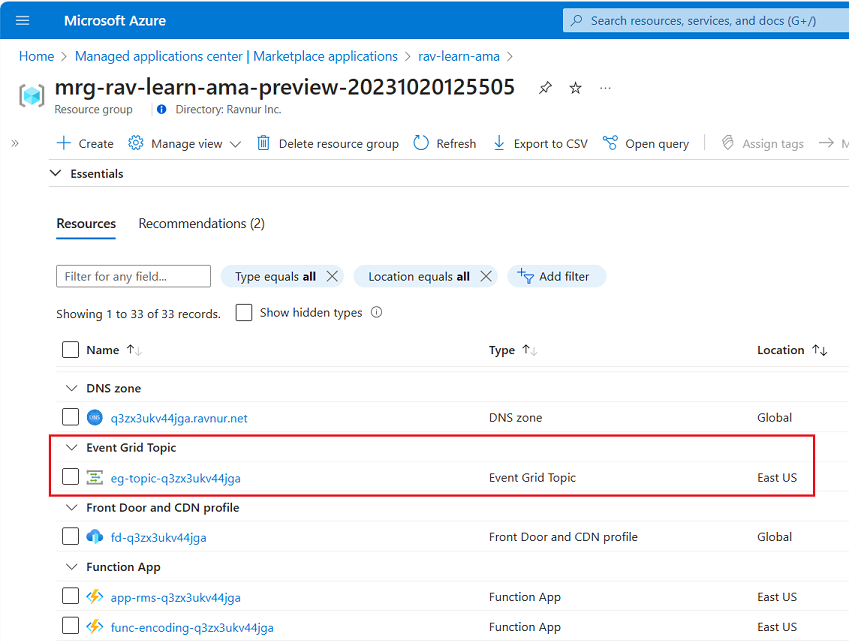
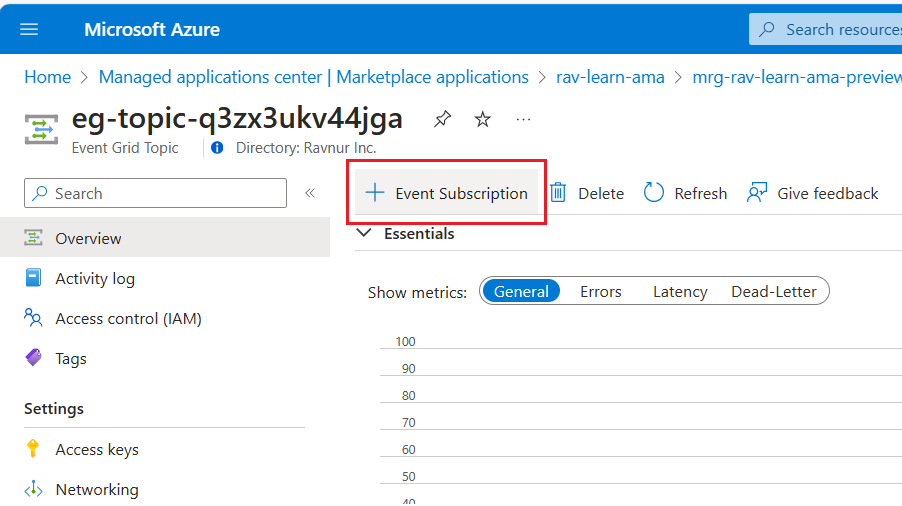

## Ravnur Media Services Event Grid events

Ravnur Media Services events allow applications to react to different events (for example, the job state change event). It is achieved without the need for complicated code - events are pushed through Azure Event Grid to event handlers such as Azure Functions, Azure Logic Apps, or even to your own Webhook.

The Ravnur Media Services event schemas are fully compatible with Azure Media Services and requires the minimal migration effort from the user side. The only required step is to migrate existing Event grid topic subscriptions from AMS Event Grid system topic to the RMS Event Grid topic. No changes to the application code are required.

### Event Grid schemas for Ravnur Media Services events

Ravnur Media Services supports all job-related event types that Azure Media Services supports. The event type names and data are exactly the same. If you have event handlers that process some or all of the job-related AMS events, you don't need to make changes to your application code.

The detailed list of the job-related events, together with schema examples, can be found in the [AMS Event Grid schemas documentation](https://learn.microsoft.com/en-us/azure/media-services/latest/monitoring/media-services-event-schemas#job-related-event-types)

### Locate the Event Grid Topic

1. Go the resource group created as part of the Ravnur Media Services deployment
2. Under the list of resources, go to the “Event Grid Topic” resource

> The name of the Event Grid Topic wll be unique for your specific deployment, however, it always follows a pattern "eg-topic-\<unique-suffix\>"

### Create Event Grid Topic Subscription

If you are familiar with the subscription creation in the AMS system topic, this process is no different.

1. Navigate to the **Event Grid Topic**
2. On the **Event Grid topic page**, select **+ Event Subscription**
3. Fill the details for your event subscirption and click **Create**

You can find more details about [Subscription creation](https://learn.microsoft.com/en-us/azure/event-grid/custom-event-quickstart-portal#subscribe-to-custom-topic) and [example message endpoint](https://learn.microsoft.com/en-us/azure/event-grid/custom-event-quickstart-portal#subscribe-to-custom-topic) in the official documentation for Event Grid.

### Receive Event Grid topic events in your subscription

Once you set up the subscription for an Event Grid Topic, use the RMS API to create an encoding job. You will able to monitor the job status using events submitted to your message handlers.
